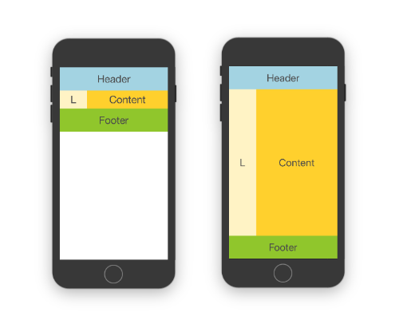

# react-native-responsive-layout

Set of components and utilities that make building responsive RN user interfaces easy by bringing concepts used on the web.

## Installation

This package is only **compatible with RN>=42**, as older versions do not support percentage-based widths.  
To install the latest version simply run:

```bash
yarn add react-native-responsive-layout
```
or if you prefer using `npm`:
```bash
npm install --save react-native-responsive-layout
```

## Responsive layout

Even though React-Native offers a great way to build complex native applications fast, building responsive UI still isn't as easy as on the web. With RN42, things got drastically better when percentage based widths landed. Still building responsive applications is quite hard without introducing many conditional renderings, this framework aims to bring many concepts we are used to on web to simplify native development.

The most important concept these components bring is **ability to specify different component sizes and to select styles depending on viewport size** to enable responsive making building responsive elements as easy as using Bootstrap grid.

It is built to be **mobile first**, so grid collapses to largest size class that it fits. This way you don't need to define sizes/styles for all breakpoint sizes, rather you can implement only those that matter and it will fallback to the first smaller one that it fits. For example, you can define only `xsSize` and `lgSize`, on all sizes lower than large it will fallback to extra small, but on all larger it will pick large one. This gives you the flexibility to target most device sizes quite precisely.

## Examples


### Flexible size (stretch to fit)

By default grid size will be based on the content size, if you want it to use flex to stretch, simply set `stretch` property on grid, it will set appropriate flex styles on child `Box` and `Section` components and enable their children to be properly rendered if using flex.

In this case by default both `Grid` and `Section` will be configured with `flex: 1` which you can override by providing custom style to any of those components. This way you can tweak size ratios of different elements.

Following image demonstrates difference:



Keep in mind that when rendering components using flex inside ScrollView, you should set flex on `contentContainerStyle` in order for it to stretch entire space. For complete example take a look at source for above [normal](examples/stretch-disabled.js) and [stretching](examples/stretch-enabled.js) examples.


## Size Classes

Sizing is mobile first so it renders depending on current size and fallbacks to lower sizes for missing breakpoint values. Therefore there is no need to explicitly define all sizes, it is possible only to target breakpoints you care about.

Based on currently popular device point sizes, grid breakpoints are chosen so it would be possible to precisely target devices of all sizes. 

Most notable **differences compared to CSS frameworks** are that we differentiate two portrait sizes for mobile devices since in many cases 100 points difference which covers almost 1/4th of the screen could be used to render things differently.

The second difference is that we are not interested in desktop sizes so we can also have more break points on large devices where there could also be a significant difference in sizes.

Based on popular device sizes grid breakpoints are divided as following:

 **Mobile** - iPhone 5/SE ( `320x568` ), iPhone 7/8 ( `375x667` ), Galaxy S6/S7 ( `360x640` )  
 **Mobile Large** - iPhone 7+/8+ ( `414x736` ) , Nexus 5X/Pixel ( `411x731` )  
 **Tablet** - iPad Mini/Air ( `768x1024` ), Nexus 9 ( `1024x768` )  
 **Tablet Large** - iPad Pro 12,9 ( `1024x1366` )


| xs     | sm           | md               | lg     | xl               | xxl                    |
|--------|--------------|------------------|--------|------------------|------------------------|
| 320    | >= 411       | >= 568           | >= 768 | >= 1024          | >= 1280                |
| Mobile | Mobile Large | Mobile Landscape | Tablet | Tablet Landscape | Tablet Large Landscape |
|        |              |                  |        | Tablet Large     |                        |

