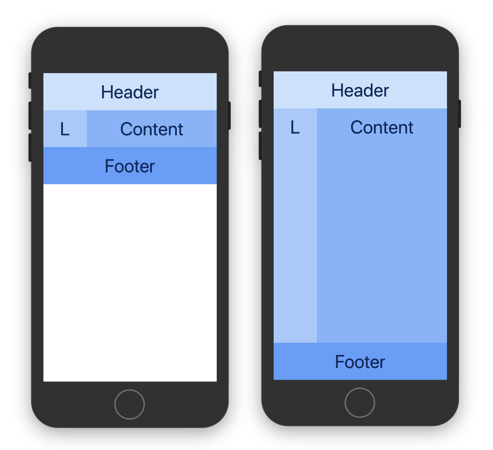

# react-native-responsive-layout

Set of components that make building responsive React user interfaces easier by bringing concepts used in web development.

## Installation

This package is only **compatible with RN >= 0.42** since older versions do not support percentage-based widths.  
To install the latest version simply run:

```bash
yarn add react-native-responsive-layout
```
alternatively, if you prefer using `npm`:
```bash
npm install --save react-native-responsive-layout
```

## Responsive layout

Even though React-Native offers a fast way to build complex native applications, creating a responsive UI still isn't as easy as on the web. Development got easier when percentage-based widths landed. However, responsive applications still requires many conditional renderings and size-specific overrides. This framework aims to bring good parts from web development to simplify native development.

The main feature of this framework is the ability to specify **different sizes, styles or even swap entire components depending on viewport size**. Making development of responsive UI as easy as using Bootstrap's grid system.

### Size Classes

The framework is built to be **mobile first**, so you build the design for the smallest screen size upward, and elements use size/style for the largest size class they can fit. If you do not define specific size, it will fallback to the first smaller defined. That means if you define only `xsSize` and `lgSize`, all sizes smaller than large use the value provided for extra small (`xsSize`), and on the rest, it uses the value of large one (`lgSize`). This way you can precisely style most device sizes. For readability, all size based props also have un-prefixed versions (eg. `size`) which are just alias for the smallest one (`xsSize`) since when using the same size across all sizes it makes things more semantically clear. 

Based on popular device sizes, classes are as following:

| Size | Breakpoint | Devices                             |
|------|------------|-------------------------------------|
| xs   | <= 410 pt  | phones                              |
| sm   | >= 411 pt  | large phones                        |
| md   | >= 568 pt  | phones - landscape                  |
| lg   | >= 768 pt  | tablets                             |
| xl   | >= 1024 pt | tablets - landscape, large tablets  |
| xxl  | >= 1280 pt | large tablets - landscape           |


## Examples

### Responsive elements

Any element that defines multiple different size classes is responsive and adapts its size. 

Following [example](examples/1-responsive-elements.js) shows how to build single column design on small phones and two column design on larger devices. You can either use `xsSize` or `size` to set base size and override it as needed. Blocks automatically fill line and break into new line when needed. However, you can also break manually by wrapping elements into another section.

```jsx
<Grid>
  <Section> {/* Light blue */}
    <Block xsSize="1/1" smSize="1/2" />
    <Block xsSize="1/1" smSize="1/2" />
    <Block xsSize="1/1" smSize="1/2" /> 
  </Section>
  <Section> {/* Dark blue */}
    <Block size="1/1" smSize="1/2" />
    <Block size="1/1" smSize="1/2" />
    <Block size="1/1" smSize="1/2" />
    <Block size="1/1" smSize="1/2" />
    <Block size="1/1" smSize="1/2" />
  </Section>
</Grid>
```


### Selectively displaying elements

This [example](examples/2-hidden-elements.js) shows how to display elements only on specific device sizes using `*hidden` properties. There are also complementary `*visible` properties which make overriding easier.

```jsx
<Grid>
  <Section>
    <Block />                  {/* default -- always visible */}
    <Block smHidden />         {/* small phones only (xs), hidden on larger */}
    <Block hidden smVisible /> {/* only large phones and up (>= sm) */}
  </Section>
</Grid>
```


### Centering and shifting elements

Since elements flow from left to right, to center element or push it to the end, you can put filler elements and manually calculate their sizes to push elements depending on device size. The more straightforward way is to use *stretching* elements, which use flex to fill the space.

To keep an element on the **left** and keep the remaining space free, just put the next element into a new section. To **center** an element, add a stretching element both before and after that element. To shift it to the **right**, just add a single stretching element before.

Since stretching elements have no way of knowing when to break into the next line and therefore the total amount of free space that is available, you should **put items you want in the same line into the same section**, just like in this [example](examples/3-shifting-elements.js). To prevent having zero width stretched elements, they have minimum width of one grid unit (`1/12`).


```jsx
<Grid>
  <Section>
    <Block xsSize="1/2" smSize="1/4" /> {/* Left */}
  </Section>
  <Section>
    <Block size="stretch" />
    <Block xsSize="1/2" smSize="1/4"></Block> {/* Center */}
    <Block size="stretch" />
  </Section>
  <Section>
    <Block size="stretch" />
    <Block xsSize="1/2" smSize="1/4"></Block> {/* Right */}
  </Section>
  <Section>
    <Block xsSize="1/3" smSize="1/4"></Block> {/* Left */}
    <Block size="stretch" />
    <Block xsSize="1/3" smSize="1/4"></Block> {/* Right */}
  </Section>
</Grid>
```


### Combining fixed and responsive widths

This [example](examples/4-fixed-size-elements.js) shows how it is possible to combine different size value types. The second section shows a solution for a real-life problem, how to combine fixed size along with stretching element to fill the remaining space.

```jsx
<Grid>
  <Section>
    <Block size={100} />      {/* 100pt */}
    <Block size="stretch" />  {/* stretch */}
    <Block size="1/4" />      {/* 1/4 */}
    <Block size="25%" />      {/* 25% */}
  </Section>
  <Section>
    <Block size={150} />      {/* fixed */}
    <Block size="stretch" />  {/* remaining width */}
  </Section>
</Grid>
```


### Different styles or components

Since size is not the only thing that needs to change depending on device size, there is also HOC available that provides selector function.

This [example](examples/5-conditional-styling.js) shows how to render components with different styles. However, using `withSizeClass` and provided `sizeSelector` property is not limited to the styles -- it works with any object so you can even render a different component depending on device size.

```jsx
const WrappedComponent = withSizeClass(({ sizeSelector }) => {
  const style = sizeSelector({
    xs: styles.lightBackground,
    sm: styles.darkBackground,
  });

  return (
    <View style={style} />
  );
});
```

Above, the `sizeSelector` function expects an object that contains sizes (breakpoints) or `default` as keys, then just like with size and hidden properties in previous examples, it selects the appropriate. The only thing remaining is to render component inside the grid.

```jsx
<Grid>
  <Section>
    <Block>
      <WrappedComponent />
    </Block>
  </Section>
</Grid>
```


### Laying out content either horizontally or vertically

Just like `ScrollView`, by providing `horizontal` property, you can change the direction in which the layout should flow. When using horizontal direction, the breakpoints are based on device **height** rather than width. This is because in horizontal flow the height is the limiting factor for conditional rendering.

```jsx
<Grid horizontal>
  <Section>
    <Block xsSize="1/1" smSize="1/2" /> {/* 2018. */}
    <Block xsSize="1/1" smSize="1/2" /> {/* 2017. */}
    <Block xsSize="1/1" smSize="1/2" /> {/* 2016. */}
  </Section>
</Grid>
```


### Stretching grid

By default, grid size will be based on the content size. If you want it to stretch over the available space, simply set the `stretch` property on the grid. It will set the appropriate styles on child `Box` and `Section` components and enable their children to be properly rendered using flex.

In this case, by default, both `Grid` and `Section` will be configured with `flex: 1` which you can override by providing a custom style to any of those components. This way you can tweak size ratios of different elements.

```jsx
<Grid stretch>
  {/* This ensures grid sections and blocks are configured to stretch. */}

  <Section style={{ height: 80, flex: 0 }}>
    {/* Since by default Sections would stretch we need to override their flex
    style in order for them to stay fixed height. */}
    <Block />
  </Section>
  <Section>
    <Block size="1/4" />  {/* L */}
    <Block size="stretch" /> {/* Content */}
  </Section>
  <Section style={{ height: 80, flex: 0 }}>
    <Block />
  </Section>
</Grid>
```



Keep in mind that when rendering components using flex inside ScrollView, you should set `{ flex: 1 }` as `contentContainerStyle` prop in order for it to stretch over the entire space. For complete examples take a look at source for the above [normal](examples/7-stretch-disabled.js) and [stretching](examples/7-stretch-enabled.js) examples.


## Note on sizes

Based on currently popular device sizes, grid breakpoints were chosen so it would be possible to precisely target devices of all sizes which means there are some notable differences compared to web frameworks.

Two sizes target portrait sizes of mobile phones, since in many cases a 100 points difference, between smaller ones and larger ones, can be used to render things differently.

Similarly larger breakpoints were chosen so they target common tablet sizes rather than desktop monitor sizes. 

These are just the defaults; you can always override breakpoints for specific grid instance by providing `breakpoints` property to `Grid`.

## Further Reading

For more information, take a look at [API docs](docs/api/).
