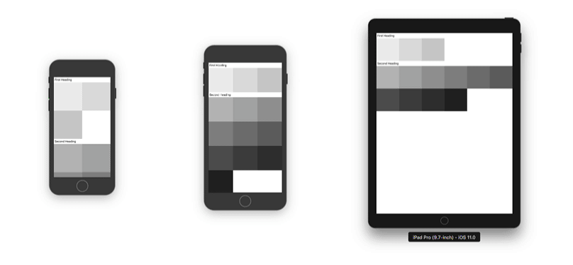

# API Reference
## Components

### Grid
A component which contains sections and Blockes. It is the source for of breaking points and size that is used as a reference for breakpoints.

- **breakpoints** - object containing sizes upon child's blocks will collapse, if you don't provide some of them it will automatically fallback to the first previous smaller, by default values are from table above:
  - **xs**: 320
  - **sm**: 411
  - **md**: 568
  - **lg**: 768
  - **xl**: 1024
  - **xxl**: 1280
- **relativeTo** (_default = window_) - whether to use breakpoints based on container size or viewport size
  - **window** - any changes to window size will trigger sizing recalculation and re-render, this will also handle when screen rotates
  - **self** - size classes will be calculated based on the grid container size, this can be useful in cases when you have only part of screen that you want to be responsive
- **direction** (_default = vertical_) - direction in which sections will be laid out, it goes hand in hand with `horizontal` property of `ScrollView`
  - **horizontal**
  - **vertical**


### Section
Section of grid elements, in default grid direction (vertical) it is same as a row in web-based grid systems. Its purpose is to group elements (blocks) together, enable breaking into new row and expansion of auto-expanding elements into remaining space.

### Block
The smallest building block of grid elements. It renders itself depending on grid size.

- **size** (_default="1/1"_) - used when there are no explicit sizes provided making block fixed width percentage across all the resolutions
- **xsSize, smSize, mdSize, lgSize, xlSize, xxlSize** - size used when specific size class is active since this grid is mobile first and cascades from smaller to larger sizes, it will choose class that is lowest resolution larger than component/window size
  - `"auto"` - when used it will stretch to be maximum width to fill remaining space surrounding other blocks, can be useful to fill spaces and to align components right
  - **numeric percentage** from 0 to 100% (eg. `30`)
  - **string fraction**, grid is based on 12's (eg. `'1/2'`, `'3/4'`... `'1/12'`)
- **xsHidden, smHidden, mdHidden, lgHidden, xlHidden, xslHidden** - just like sizes, it will hide element attribute depending on current size

## Wrappers
### withSizeClass(Component) → Component

Provides component with size class that is determined by parent grid.

- **size** - provides first parent's grid size class (eg. `sm`, `lg`...)
- **sizeSelector** - depending on current grid size, selects relevant value from object, that contains sizes as keys, it is possible to provide only some of them, just like rest of grid, it will fallback to first smaller that satisfies criteria, especially useful when using with styles since it enables selection of appropriate style to match the block size (eg. you can create matching `lgSize` and `lg` style).

This way we can simply create button that would look great on all device sizes when rendered inside the grid:

```javascript
const ResponsiveButton = withSizeClass(({ sizeSelector, ...props}) => {
  // Use provided method to select appropriate object
  const style = sizeSelector({
    xs: styles.smallButton,
    sm: styles.mediumButton,
    md: styles.largeButton,
  });
  return (
    <TouchableOpacity onPress={props.onPress}>
      <View style={[style, props.containerStyle]}>
        <Text style={props.textStyle}>{props.title}</Text>
      </View>
    </TouchableOpacity>
  );
});

```


You can find full [example here](../../examples/withSizeClass.js).

If you only want to hide or show certain components on specific size classes please check [Block](#block)'s `Hidden` props that will conditionally hide component.

### withContainerDimensions(Component) → Component

Provides component with current `width` and `height` that first outer grid uses to determine sized, depending on grid's `relativeTo` prop it will be either viewport or grid itself.

- **width** - reference component width
- **height** - reference component height

If you do not care about exact dimensions, rather size class, it is better to use [withSizeClass](#withsizeclasscomponent--component) since it causes re-rendering only when class changes rather than when any of provided dimensions change.

```javascript
// To make use of width and height in our component, we just access width and 
// height as props:
const Info = ({ width = 0, height = 0}) => (
  <Text>{width}pt x {height}pt</Text>
);

// then we wrap our component with withContainerDimensions
const WrappedInfo = withContainerDimensions(Info);

// and when wrapped is rendered inside Grid it will be provided with values.
<Grid>
// ...
    <WrappedInfo />
// ...
```


For complete code along with how grid nesting works along with it take a look at [full example](../../examples/withContainerDimensions.js).


## Utility Functions

### calculateStretchLength(totalLength, minimalElementLength) → length

Calculates minimal length larger or equal to provided that enables elements to be proportionally stretched in a provided total length. This is useful for building grids that have objects of equal width/height and have the specific minimal size. This way element will never be stretched never more than twice the size (since then two of them would fit using smaller length). 

Most obvious usage of this function would be to build HOC that represents tiles in gallery, this is especially useful in combination with `withContainerDimensions` of Grid that is `relativeTo='self'` since it enables us to get its width:

```javascript
const Card = withContainerDimensions(({ width }) => {
  const l = calculateStretchLength(width, 120);
  return (
    <View style={{ width: l, height: l }} />
  );
});
```

When using images, keep in mind that calculated length will always be between minimal element length and double the minimal element length, so you can pick sensible value depending on resolution of thumbnails.

If grid spans entire width, it makes more sense to use `realativeTo='window'` (default value) to avoid unneeded re-rendering.



Entire gallery is available in [tiles example](../../examples/tiles.js).
