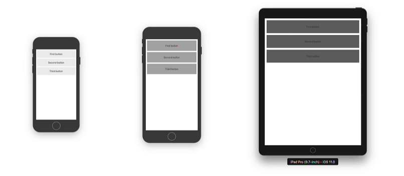
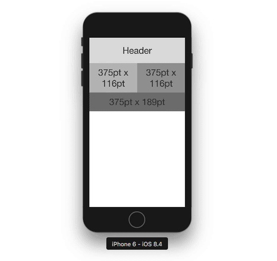

# API Reference

## Components

### Grid
A component which contains sections and blocks.

- **breakpoints** - an object containing sizes upon child's blocks will collapse; if you do not provide some of them it automatically fallbacks to the first previous smaller; default values are from the table at the bottom of this page:
  - **xs**: 320
  - **sm**: 411
  - **md**: 568
  - **lg**: 768
  - **xl**: 1024
  - **xxl**: 1280
- **relativeTo** (_default = window_) - whether to use breakpoints based on container size or viewport size
  - **window** - any changes to window size triggers recalculation and re-render, on devices this is usually when screen rotates
  - **self** - size classes will be calculated based on the grid container size, this can be useful in cases when you have only part of screen that you want to be responsive
  - **parent** - size classes will be calculated based on the container size of their parent grid, this can be useful in cases when you have nested grids and want child grids to calculate their size class based on width or height of their parent grid
- **horizontal** - if provided it will flow horizontally, it goes hand in hand with `horizontal` property of `ScrollView`
- **stretchable** - whether the grid should stretch the available space, this has no effect on sections that do not have the `stretch` property
- **scrollable** - option which enables scrolling on a grid, if grid content doesn't fit the screen
- **xsStyle, smStyle, mdStyle, lgStyle, xlStyle, xxlStyle** - style used when specific size class is active; similar to the size in a Block, it will override the style based on the active size.
- **style** - general style regardless of active size

### Section
Container for blocks, in default grid direction (vertical) it behaves the same as a row in web-based grid systems. Its purpose is to group elements (blocks) and enable breaking into the new row.
- **stretch** - whether section should stretch the available space, only works when grid is `stretchable`
- **xsStyle, smStyle, mdStyle, lgStyle, xlStyle, xxlStyle** - style used when specific size class is active; similar to the size in a Block, it will override the style based on the active size.
- **style** - general style regardless of active size

### Block
The smallest building block of grid elements. It renders itself depending on grid size.

- **size** (_default="1/1"_) - used when there are no explicit sizes provided making block fixed width percentage across all the resolutions
- **xsSize, smSize, mdSize, lgSize, xlSize, xxlSize** - size used when specific size class is active; since this grid is mobile first and cascades from smaller to larger sizes, it will choose class that is lowest resolution larger than component/window size; it works similarly to React's width and height but it takes some additional arguments 
  - `"stretch"` - when used it stretches to be maximum width to fill remaining space surrounding other blocks, it can be useful to align components center or right
  - **string percentage**, from 0 to 100% (eg. `'30%'`)
  - **string fraction**, grid is based on 12's (eg. `'1/2'`, `'3/4'`... `'1/12'`)
  - **numeric points**, fixed size in points (eg. `100`)
- **hidden, xsHidden, smHidden, mdHidden, lgHidden, xlHidden, xxlHidden** - just like sizes, it will hide element attribute depending on current size
- **visible, xsVisible, smVisible, mdVisible, lgVisible, xlVisible, xxlVisible** - counterparts to the hidden classes
- **xsStyle, smStyle, mdStyle, lgStyle, xlStyle, xxlStyle** - style used when specific size class is active; similar to the size above, it will override the style based on the active size.
- **style** - general style regardless of active size

## Wrappers

### SizeInfo

Function as child component that provides an object with currently active size class that is determined by parent grid, as well as a size selector function.

- **size** - provides outer grid's size class (eg. `sm`, `lg`...)
- **sizeSelector** - depending on current grid size, selects relevant value from object that contains sizes as keys; it is possible to provide only some of them and it will fallback to first smaller that satisfies criteria; especially useful when using with styles since it enables selection of appropriate style to match the block size (eg. you can create matching `lgSize` and `lg` style).

This way we can simply create button that would look great on all device sizes when rendered inside the grid:

```javascript
const ResponsiveButton = (props) => (
    <SizeInfo>
      {({ sizeSelector }) => {
        // Use provided method to select appropriate object
        const style = sizeSelector({
          xs: styles.smallButton,
          sm: styles.mediumButton,
          md: styles.largeButton,
        });
        return (
          <TouchableOpacity onPress={props.onPress}>
            <View style={[style, props.containerStyle]}>
              <Text style={props.textStyle}>{props.title}</Text>
            </View>
          </TouchableOpacity>
        );
      }}
    </SizeInfo>
);

```
### withSizeInfo(Component) → Component

Higher order component that provides prop values for currently active size class that is determined by parent grid, as well as a size selector function.

- **size** - provides outer grid's size class (eg. `sm`, `lg`...)
- **sizeSelector** - depending on current grid size, selects relevant value from object, that contains sizes as keys; it is possible to provide only some of them and it will fallback to first smaller that satisfies criteria; especially useful when using with styles since it enables selection of appropriate style to match the block size (eg. you can create matching `lgSize` and `lg` style).

This way we can simply create button that would look great on all device sizes when rendered inside the grid:

```javascript
const ResponsiveButton = withSizeInfo(({ sizeSelector, ...props}) => {
  // Use provided method to select appropriate object
  const style = sizeSelector({
    xs: styles.smallButton,
    sm: styles.mediumButton,
    md: styles.largeButton,
  });
  return (
    <TouchableOpacity onPress={props.onPress}>
      <View style={[style, props.containerStyle]}>
        <Text style={props.textStyle}>{props.title}</Text>
      </View>
    </TouchableOpacity>
  );
});

```



You can find the full [example here](../../examples/withSizeInfo.js).

If you only want to hide or show specific components on specific size classes, please check [Block](#block)'s `Hidden` props that conditionally hide component.

### GridDimensions

Provides current `width` and `height` of first outer grid.

- **width** - grid component width
- **height** - grid component height

If you do not care about exact dimensions, rather size class, it is better to use [SizeInfo](#sizeinfo) since it causes re-rendering only when class changes rather than when any of provided dimensions change.

```javascript
// To make use of width and height in our component, we just access width and 
// height provided by GridDimensions FaCC:
const Info = () => (
  <GridDimensions>
    {({ width, height }) => (
      <Text>{width}pt x {height}pt</Text>
    )}
  </GridDimensions>
);

// when it is rendered inside Grid your component is provided with values.
<Grid>
// ...
    <Info />
// ...
```

### withGridDimensions (Component) → Component

HOC that offers same functionality as GridDimensions. Provides current `width` and `height` of the first outer grid.

- **width** - grid component width
- **height** - grid component height

If you do not care about exact dimensions, rather size class, it is better to use [withSizeInfo](#withsizeinfocomponent--component) since it causes re-rendering only when class changes rather than when any of provided dimensions change.

```javascript
// To make use of width and height in our component, we just access width and 
// height provided by withGridDimensions HOC:
const Info = withGridDimensions(({ width, height })  => (
  <Text>{width}pt x {height}pt</Text>
));

// when it is rendered inside Grid your component is provided with values.
<Grid>
// ...
    <Info />
// ...
```



For complete code along with how grid nesting works along with it take a look at the [full example](../../examples/withGridDimensions.js).


## Utility Functions

### calculateStretchLength(totalLength, minimalElementLength) → length

Calculates minimum length larger or equal to provided that enables elements to be proportionally stretched in a provided total length. This is useful for building grids that have objects of equal width/height and have the specific minimum size. This way element will never be stretched more than twice the size (since then two of them would fit using smaller length). 

Most obvious usage of this function would be to build component that represents tiles in a gallery; this is especially useful in combination with `GridDimensions` since it enables us to get grids width:

```javascript
const Card = () => (
    <GridDimensions>
      {({ width }) => {
        const l = calculateStretchLength(width, 120);
        return (
          <View style={{ width: l, height: l }} />
        )
      }}
    </GridDimensions>
  );
```

When using images, keep in mind that calculated length will always be between minimal element length and double the minimal element length, so you can pick reasonable value depending on the resolution of thumbnails.

If grid spans entire width, it makes more sense to use `relativeTo="window"` (default value) to avoid unneeded re-rendering.


Entire gallery is available in [tiles example](../../examples/tiles.js).


## Source for sizes

Default sizes are based on following device sizes:

 **Mobile** - iPhone 5/SE ( `320x568` ), iPhone 7/8 ( `375x667` ), Galaxy S6/S7 ( `360x640` )  
 **Mobile Large** - iPhone 7+/8+ ( `414x736` ) , Nexus 5X/Pixel ( `411x731` )  
 **Tablet** - iPad Mini/Air ( `768x1024` ), Nexus 9 ( `1024x768` )  
 **Tablet Large** - iPad Pro 12,9 ( `1024x1366` )


| xs     | sm           | md               | lg     | xl               | xxl                    |
|--------|--------------|------------------|--------|------------------|------------------------|
| 320    | >= 411       | >= 568           | >= 768 | >= 1024          | >= 1280                |
| Mobile | Mobile Large | Mobile Landscape | Tablet | Tablet Landscape | Tablet Large Landscape |
|        |              |                  |        | Tablet Large     |                        |
